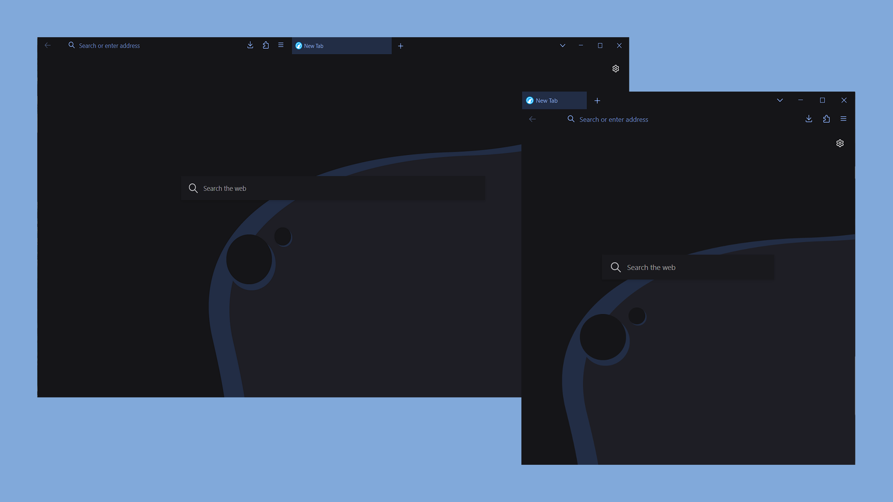

# Firefox/Librewolf userChrome.css config

# How to Install
1. In your Firefox browser search `about:config`. Press the **I accept the risk** button.
2. Seach `toolkit.legacyUserProfileCustomizations.stylesheets` and change to **true**
3. Go to `about:profiles` page and open your profile root directory.
4. Copy `chrome` directory and its conten from repository to your profile directory.
5. Restart browser and enjoy.

# Credits
- https://github.com/migueravila/SimpleFox
- https://github.com/andreasgrafen/cascade
- https://github.com/crambaud/cascade
- https://github.com/MrOtherGuy/firefox-csshacks

# Keyboard Shortcuts

| Windows / Linux                              | MacOS                            | Description                         |
| -------------------------------------------- | -------------------------------- | ----------------------------------- |
| `Ctrl + L`                                   | `Command + L`                    | focuses the URL bar                 |
| `Ctrl + B`                                   | `Command + B`                    | toggles the bookmark sidebar        |
| `Ctrl + Shift + B`                           | `Command + Shift + B`            | toggles the personal toolbar        |
| `Alt + Left Arrow`                           | `Command + Left Arrow`           | navigates backwards in your history |
| `Alt + Right Arrow`                          | `Command + Right Arrow`          | navigates forwards in your history  |
| `Ctrl + T`                                   | `Command + T`                    | opens a new tab                     |
| `Ctrl + Shift + T`                           | `Command + Shift + T`            | reopens the last closed tab         |
| `Ctrl + W`                                   | `Command + W`                    | closes the current tab              |
| `Ctrl + Page Up` or `Ctrl + Shift + Tab` | `Command + Option + Left Arrow`  | navigates to the previous tab       |
| `Ctrl + Page Down` or `Ctrl + Tab`       | `Command + Option + Right Arrow` | navigates to the next tab           |
